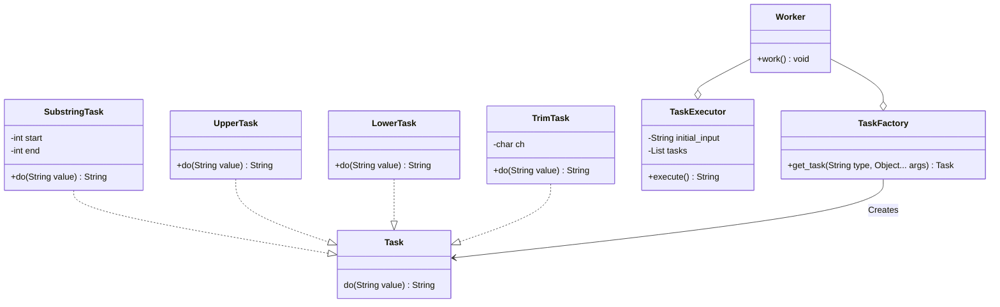
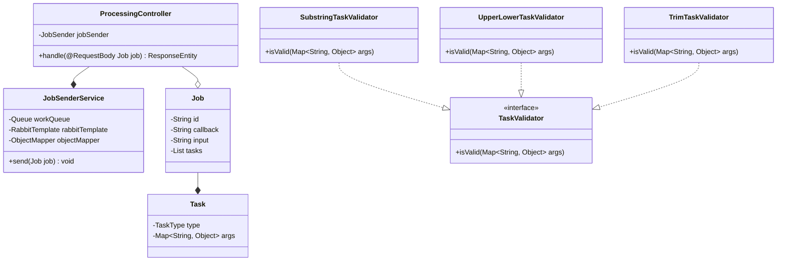

## Worker Application

```mermaid
classDiagram
    class Worker {
        +work() void
    }
    
    class Task {
        do(String value) String
    }
    
    class SubstringTask {
        -int start
        -int end
        
        +do(String value) String
    }
    
    class UpperTask {
        
        +do(String value) String
    }
    
    class LowerTask {
        
        +do(String value) String
    }
    
    class TrimTask {
        -char ch
        
        +do(String value) String
    }
    
    class TaskExecutor {
        -String initial_input
        -List<Task> tasks
        
        +execute() String
    }
    
    class TaskFactory {
        +get_task(String type, Object... args) Task
    }
    
    
    SubstringTask ..|> Task
    UpperTask ..|> Task
    LowerTask ..|> Task
    TrimTask ..|> Task
    Worker --o TaskFactory
    Worker --o TaskExecutor
    TaskFactory --> Task : Creates
```

## REST Server

```mermaid
    classDiagram
        class ProcessingController{
            -JobSender jobSender
            
            +handle(@RequestBody Job job) ResponseEntity
        }
        
        class JobSenderService{
            -Queue workQueue
            -RabbitTemplate rabbitTemplate
            -ObjectMapper objectMapper
            
            +send(Job job) void
        }
        
        class Task{
            -TaskType type
            -Map~String, Object~ args
        }
        
        class Job{
            -String id
            -String callback
            -String input
            -List<Task> tasks
        }
        
        class TaskValidator {
            <<interface>>
            +isValid(Map~String, Object~ args)
        }
        
        class SubstringTaskValidator {
            +isValid(Map~String, Object~ args)
        }
        
        class UpperLowerTaskValidator {
            +isValid(Map~String, Object~ args)
        }
        
        class TrimTaskValidator {
            +isValid(Map~String, Object~ args)
        }
        
        SubstringTaskValidator ..|> TaskValidator
        UpperLowerTaskValidator ..|> TaskValidator
        TrimTaskValidator ..|> TaskValidator
        ProcessingController --* JobSenderService
        Job --* Task
        ProcessingController --o Job
```