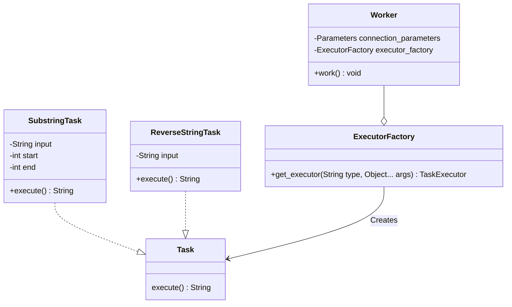
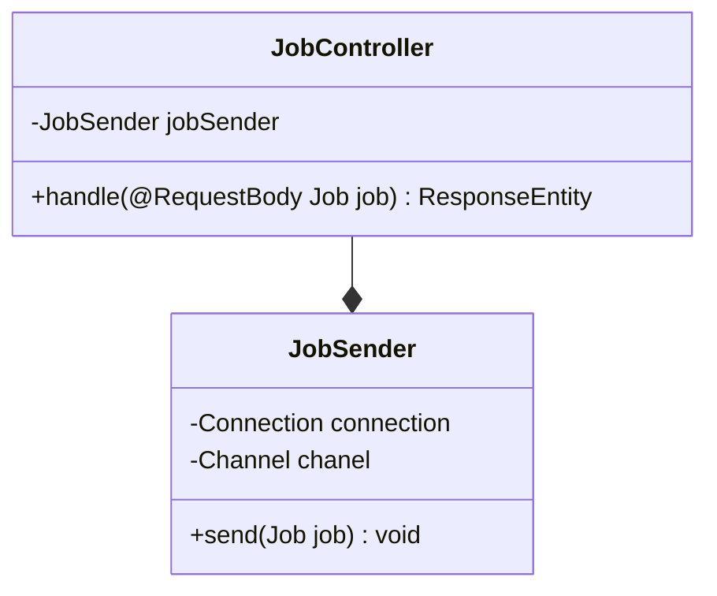

## Worker Application

```mermaid
classDiagram
    class Worker {
        -Parameters connection_parameters
        -ExecutorFactory executor_factory
        
        +work() void
    }
    
    class Task {
        execute() String
    }
    
    class ReverseStringTask {
        -String input
        
        +execute() String
    }
    
    class SubstringTask {
        -String input
        -int start
        -int end
        
        +execute() String
    }
    
    class ExecutorFactory {
        +get_executor(String type, Object... args) TaskExecutor
    }
    
    SubstringTask ..|> Task
    ReverseStringTask ..|> Task
    Worker --o ExecutorFactory
    ExecutorFactory --> Task : Creates
```

## REST Server

```mermaid
    classDiagram
        class JobController{
            -JobSender jobSender
            
            +handle(@RequestBody Job job) ResponseEntity
        }
        
        class JobSender{
            -Connection connection
            -Channel chanel
            
            +send(Job job) void
        }
        
        JobController --* JobSender
```