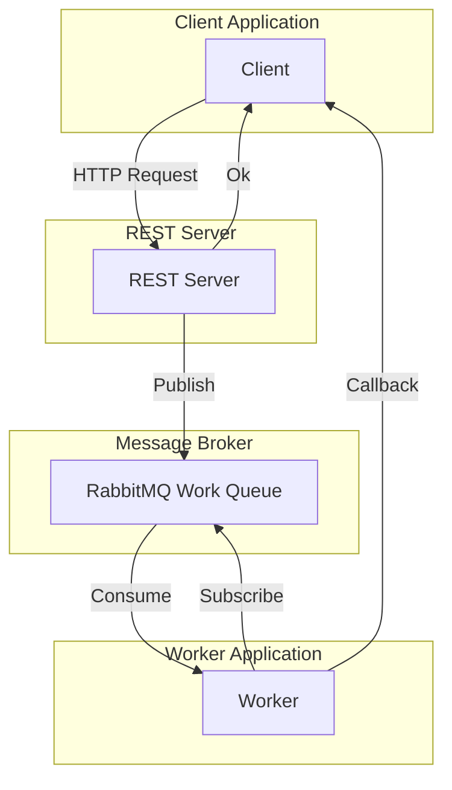

```mermaid
graph TB;
    subgraph Client Application 
        Client[Client]
    end
    
    subgraph REST Server
        REST_Server[REST Server]
    end

    subgraph Message Broker
        RabbitMQ_Work_Queue[RabbitMQ Work Queue]
    end

    subgraph Worker Application
        Worker[Worker]
    end
    
    Client -->|HTTP Request| REST_Server;
    REST_Server -->|Publish| RabbitMQ_Work_Queue;
    REST_Server -->|Ok| Client;
    Worker -->|Subscribe| RabbitMQ_Work_Queue;
    RabbitMQ_Work_Queue -->|Consume| Worker;
    Worker -->|Callback| Client;
```