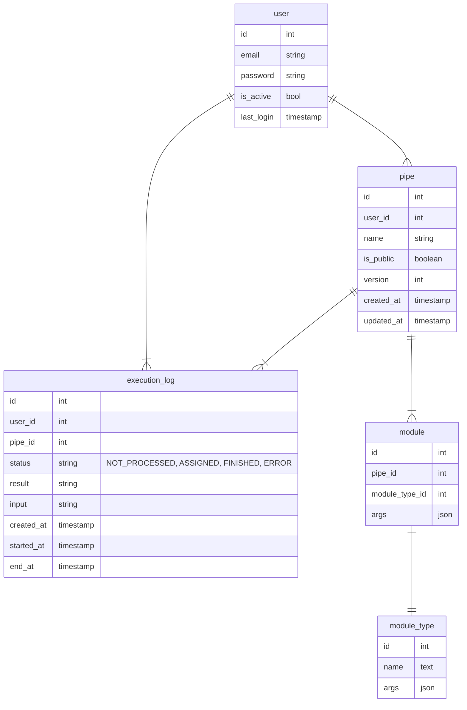

```mermaid
erDiagram
    user {
        id int
        email string
        password string
        is_active bool
        last_login timestamp
    }
    
    execution_log {
        id int
        user_id int
        pipe_id int
        status string "NOT_PROCESSED, ASSIGNED, FINISHED, ERROR"
        result string
        input string
        created_at timestamp
        started_at timestamp
        end_at timestamp
    }
    
    pipe {
        id int
        user_id int
        name string
        is_public boolean
        version int
        created_at timestamp
        updated_at timestamp
    }
    
    module {
        id int
        pipe_id int
        module_type_id int
        args json
    }
    
    module_type {
        id int
        name text
        args json
    }
    
    user ||--|{ pipe : ""
    pipe ||--|{ module : ""
    module ||--|| module_type: ""
    user ||--|{ execution_log: ""
    pipe ||--|{ execution_log: ""
    
```